# TrustGrade – מדריך שימוש למרצים ולתלמידים

מדריך זה מסביר כיצד להשתמש בתוסף TrustGrade ב-Moodle: הגדרת מטלות, יצירת שאלות, בדיקת הנחיות עם AI, חידונים לסטודנטים ודוחות.

> **צילומי מסך:** התמונות ב־`docs/screenshots/` (01, 02, 03, 05–07, 09, 09b, 10, 12, 12b, 13–17, 19, 20, 22, 23). מיפוי מלא ב־`docs/screenshots/README.txt`.

---

## תוכן עניינים

1. [מהו TrustGrade?](#מהו-trustgrade)
2. [למרצים: התחלה מהירה](#למרצים-התחלה-מהירה)
3. [הגדרת מטלה עם TrustGrade](#הגדרת-מטלה-עם-trustgrade)
4. [מאגר שאלות ובדיקת הנחיות](#מאגר-שאלות-ובדיקת-הנחיות)
5. [יצירת שאלות מקובצים](#יצירת-שאלות-מקובצים)
6. [דוח חידון והערכת הגשה (AI)](#דוח-חידון-והערכת-הגשה-ai)
7. [עמוד ציונים וקישור לדוח תלמיד](#עמוד-ציונים-וקישור-לדוח-תלמיד)
8. [לסטודנטים: הגשה וחידון AI](#לסטודנטים-הגשה-וחידון-ai)
9. [שאלות נפוצות](#שאלות-נפוצות)

---

## מהו TrustGrade?

TrustGrade הוא תוסף ל-Moodle שמאפשר:

- **יצירת שאלות אוטומטית** – שאלות חידון נוצרות על בסיס ההגשה של הסטודנט (AI) ו/או ממאגר שאלות המרצה.
- **בדיקת הנחיות עם AI** – המלצות לשיפור הנחיות המטלה לפי קריטריונים פדגוגיים.
- **חידון אישי לסטודנט** – לאחר הגשה, הסטודנט מקבל חידון מותאם להגשה שלו.
- **דוח חידון** – ציוני חידון, יושרה (מעקב יציאה מהחלון), והערכת הגשה (AI): הערכה, ציון מוצע, חוזקות והצעות לשיפור.

**דרישה:** נדרש חיבור לשירות TrustGrade AI Gateway (מנוי דרך Originality LTD / CentricApp).

---

## למרצים: התחלה מהירה

1. **הוספת מטלה**  
   בקורס: **הוסף פעילות או משאב** → בחר **מטלה (Assignment)**.

   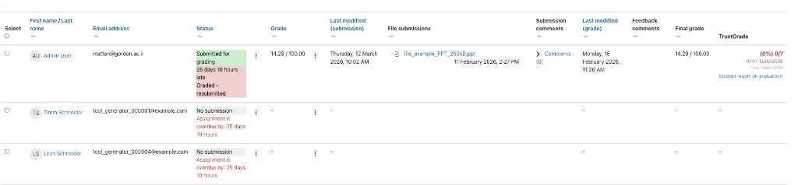

2. **הפעלת TrustGrade במטלה**  
   בעריכת המטלה, בקטע **TrustGrade**:
   - **הפעלת הרכיב:** בחר **כן**.
   - תחת **הגדרות חידון** הגדר חלוקת שאלות, זמן לכל שאלה ואם לחייב השלמת חידון.

3. **מאגר שאלות ובדיקת הנחיות**  
   בתפריט המטלה (**עוד** → **מאגר שאלות ובדיקת הנחיות**) – לעריכת הנחיות, העלאת קבצים ובדיקה עם AI. תפריט המטלה: תמונה 12b.

4. **דוח חידון**  
   **עוד** → **TrustGrade Report** – צפייה בציוני חידון, ציונים ידניים והערכת הגשה (AI) לכל סטודנט.

---

## הגדרת מטלה עם TrustGrade

צילום מסך של עמוד הגדרות המטלה ב-Moodle, בו מופיע בלוק **TrustGrade**. במסך זה המרצה מפעיל את התוסף ומגדיר פרמטרים.

### הפעלת הרכיב

- **הפעלת הרכיב** – כן / לא.  
  רק כאשר מופעל, יוצגו לסטודנטים חידון ויכולות נוספות של TrustGrade.

### הגדרות חידון

- **מספר שאלות מהמאגר** – מספר השאלות שיילקחו ממאגר השאלות (מאגר שאלות ובדיקת הנחיות).
- **מספר שאלות מבוססות הגשה** – מספר השאלות שייווצרו אוטומטית מההגשה של הסטודנט (AI).
- **זמן לשאלה** – זמן מוגבל לענות על כל שאלה (למשל 25 שניות).
- **חייב את הסטודנט/ית להשלים את החידון** – אם מסומן, גישה לעמודים אחרים ב-Moodle תיחסם עד השלמת החידון (עד 24 שעות מהפעם הראשונה).
- **שלח התראה על שינוי תוכן** – התראה לסטודנטים כשמשתנים שאלות או הגדרות.

שמירה: **שמור וחזור לקורס** או **שמור והצג**.

---

## מאגר שאלות ובדיקת הנחיות

נתיב: במטלה → **עוד** → **מאגר שאלות ובדיקת הנחיות**.

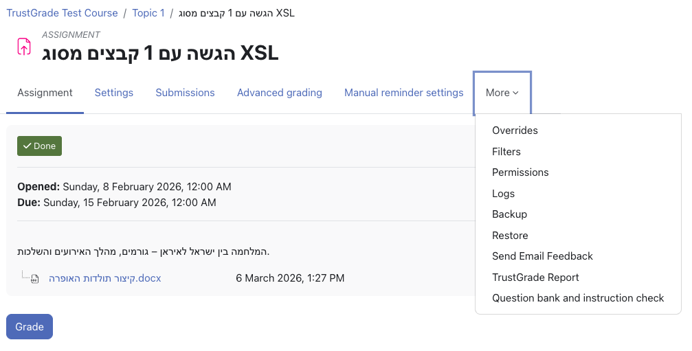

### מה מופיע בעמוד

- **הנחיות המטלה** – מתוך הגדרות המטלה (תיאור המטלה והנחיות הפעילות).
- **קבצים מהמטלה** – קבצים מצורפים (intro, activity וכו').
- **עריכת הנחיות** – ניתן לערוך את ההנחיות ישירות ולשמור (כפתור **שמור הנחיות**).
- **בדוק הנחיות עם AI** – לחיצה על הכפתור שולחת את ההנחיות והקבצים ל-AI ומקבלים **המלצת AI**.

### המלצת AI – בדיקת קריטריונים פדגוגיים (22)

מסך בדיקת קריטריונים פדגוגיים: איכות המטלה, שימוש במקורות, רמת חשיבה, הערכה אקדמית.

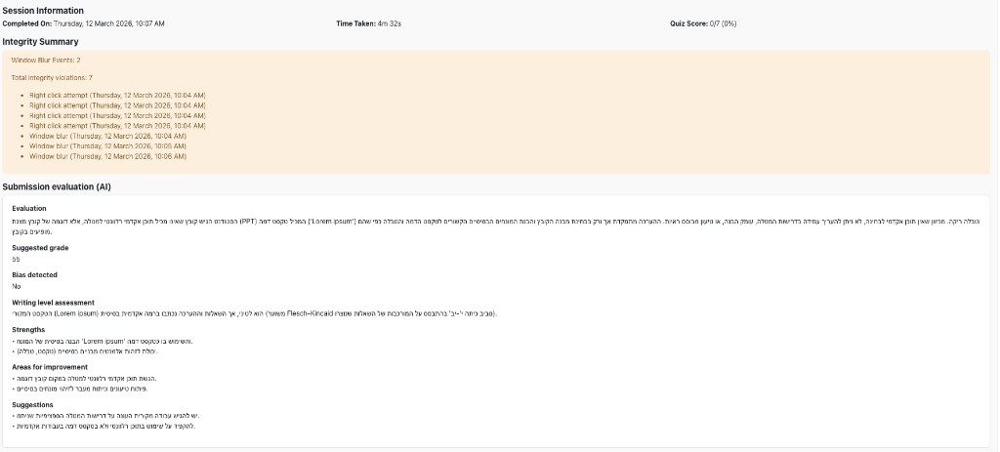

- **קריטריון** – מטרת למידה ברורה, דרישות ברורות, הנחיות לשימוש במקורות, קריטריוני הערכה, יושרה אקדמית.
- **הושג** – האם הקריטריון מתקיים (כן/לא).
- **הצעות** – המלצות ספציפיות לשיפור.

בתחתית מופיעים **הערכה** כללית ו-**המטלה המשופרת** (טקסט מוצע להנחיות משופרות).

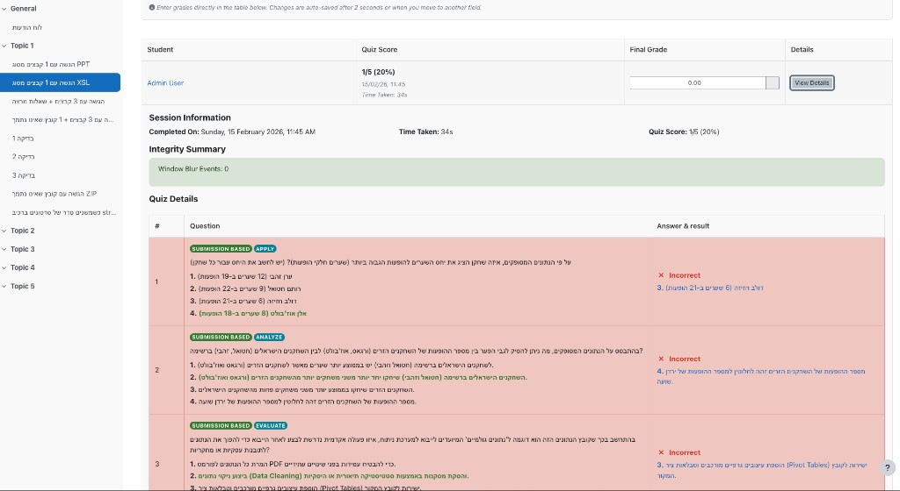

ניתן לערוך את ההנחיות בעמוד לפי ההמלצות ולשמור.

---

## יצירת שאלות מקובצים

ניתן ליצור שאלות אוטומטית מהקבצים שהמרצה מעלה (למשל קובץ Word עם חומר הקורס).

### מסך יצירת שאלות ע"י המרצה (12)

מסך **Create questions from files**: המרצה יכול להעלות קבצים, לבחור מספר שאלות, להוסיף הנחיות ל-AI וליצור שאלות.

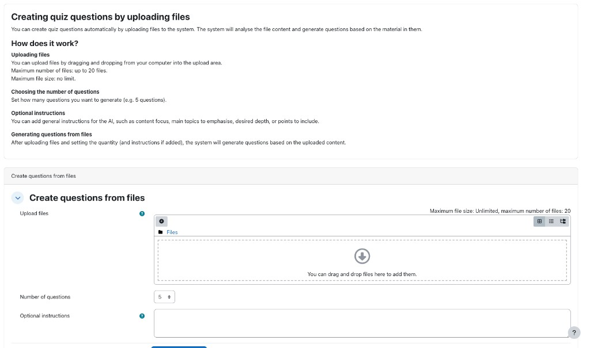

### העלאת קבצים (19)

מסך שבו המרצה מעלה קובצי מקור (למשל DOCX); המערכת משתמשת בהם כדי ליצור שאלות חידון.

1. **העלאת קבצים** – גרירה לאזור או לחיצה על הוספת קובץ.
2. **מספר שאלות** – מספר השאלות ליצירה (למשל 5).
3. **הנחיות אופציונליות** – טקסט חופשי להנחיית ה-AI.
4. **Generate questions** – התחלת יצירת השאלות.

### הודעה על יצירת השאלות (07)

לאחר ההרצה מוצגת הודעה: **Question generation has started** ו-**Generating questions… Please wait** – תהליך ה-AI פועל ברקע.

### ניהול שאלות AI (20)

מסך ניהול שאלות שנוצרו ע"י AI: ניתן לערוך שאלות, למחוק ולהגדיר חובה.

- **שאלה** – טקסט השאלה, רמת Bloom (Remember, Understand וכו').
- **סימון חובה (16)** – "Mark as Mandatory" – לסמן שאלה כחובה שתופיע בחידון.

- **אפשרויות תשובה** – הסבר לכל אפשרות וסימון תשובה נכונה.
- **עריכה / מחיקה** – כפתורי Edit ו-Delete.

ניתן לערוך שאלות, להוסיף למאגר המטלה ולהשתמש בהן ב"שאלות ממאגר המרצה".

---

## דוח חידון והערכת הגשה (AI)

נתיב: במטלה → **עוד** → **TrustGrade Report** (או **דוח חידון**).

### דוח חידון תלמידים (09b)

רשימת תלמידים בדוח החידון: ציוני חידון, ציון סופי, קישור לצפייה בפרטי התלמיד.

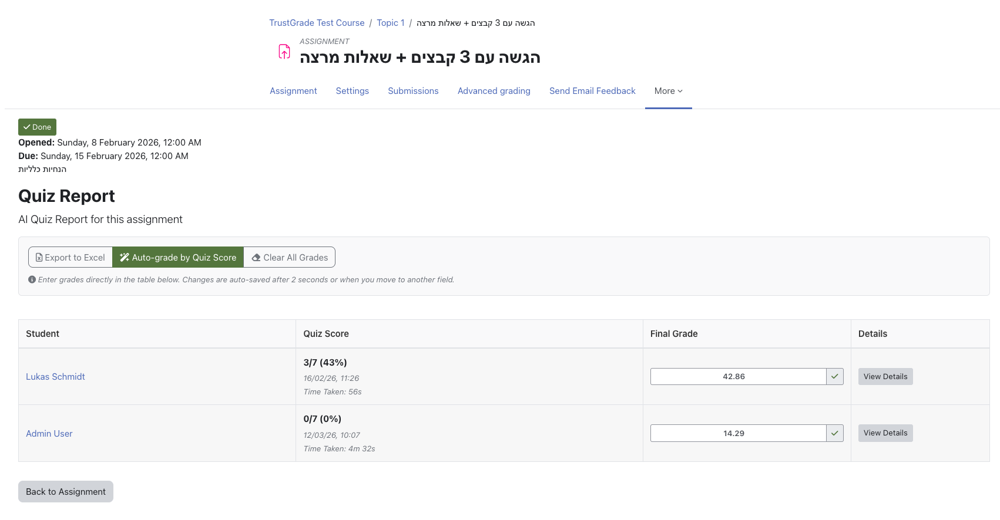

- **סטודנט** – שם וקישור לפרופיל.
- **ציון חידון** – X/Y (אחוז%), תאריך ושעה, זמן שהייה.
- **ציון סופי** – שדה להזנת ציון (נשמר אוטומטית לאחר ~2 שניות או מעבר שדה).
- **פרטים** – כפתור **הצג פרטים**.

כפתורי פעולה: **Export to Excel**, **Auto-grade by Quiz Score**, **Clear All Grades**.

### דוח חידון והערכה (09)

מסך שמציג תוצאות החידון, ניתוח AI של המטלה, ציון מוצע, חוזקות וחולשות של ההגשה והמלצות לשיפור.

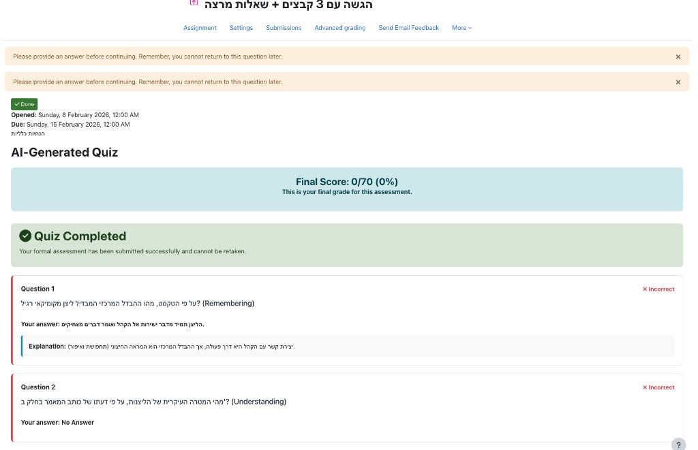

### פרטי תלמיד (13)

לחיצה על **הצג פרטים** פותחת כרטיס עם פרטי ניסיון החידון, זמן ביצוע, הפרות Integrity וציוני החידון.

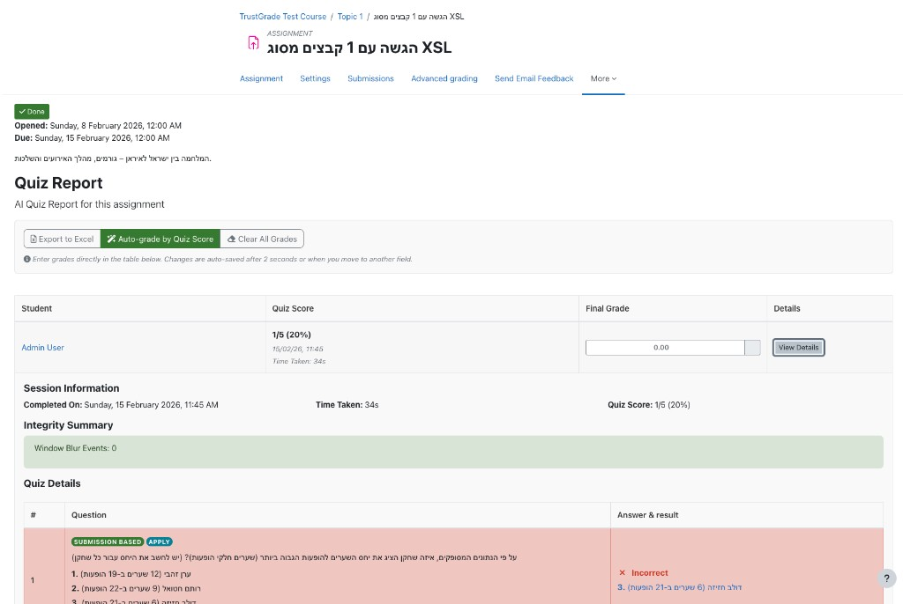

- **מידע על המפגש** – תאריך השלמה, זמן שנדרש, ציון חידון.
- **סיכום יושרה** – אירועי יציאה מהחלון (Window Blur).
- **הערכת הגשה (AI)** – הערכה, ציון מוצע, חוזקות, נקודות לשיפור, הצעות.
- **פרטי חידון** – כל שאלה, התשובה של הסטודנט והתוצאה (נכון/לא נכון).

---

## עמוד ציונים וקישור לדוח תלמיד (14)

טבלת הגשות של המטלה הכוללת עמודת **TrustGrade**: ציון AI, אחוז אמינות, זמן ביצוע החידון וקישור לדוח תלמיד.

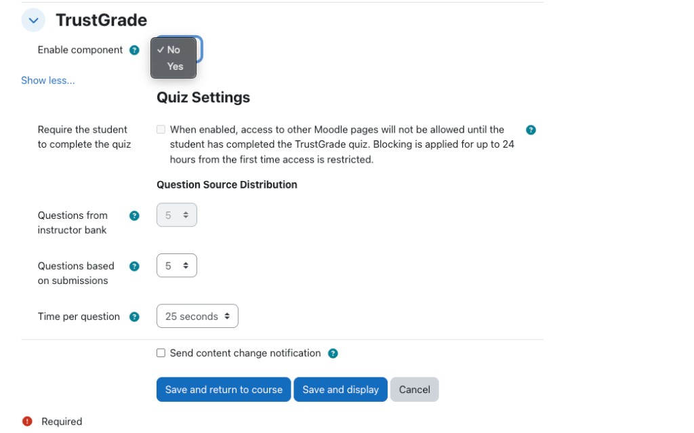

בכל שורת סטודנט שסיים חידון: ציון החידון (X/Y ואחוז), תאריך ושעה, זמן שנדרש, **קישור "דוח תלמיד (הערכת הגשה AI)"**. אם לסטודנט אין ציון חידון – יוצג "־" בלי קישור.

---

## לסטודנטים: הגשה וחידון AI

### הגשת מטלה (10)

מסך שבו סטודנט מגיש את המטלה. כולל בלוק **AI-Enhanced Learning Experience** המסביר כי לאחר ההגשה ייווצר חידון אישי.

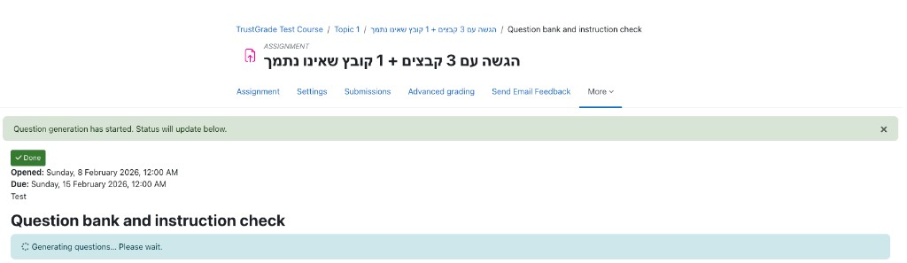

- העלאת קבצים / הזנת טקסט לפי הגדרות המטלה.
- **שמירת שינויים** כדי לשלוח את ההגשה.

### החידון בתהליך יצירה (17)

הודעה לסטודנט שהחידון עדיין נוצר: אינדיקציה לטעינה והודעה שהמערכת מייצרת שאלות.

### הודעה שהחידון מוכן (06)

הודעה קופצת לסטודנט לאחר ניתוח ההגשה: החידון האוטומטי מוכן, נוצר על בסיס ההגשה שלו, ואפשר להתחיל את החידון.

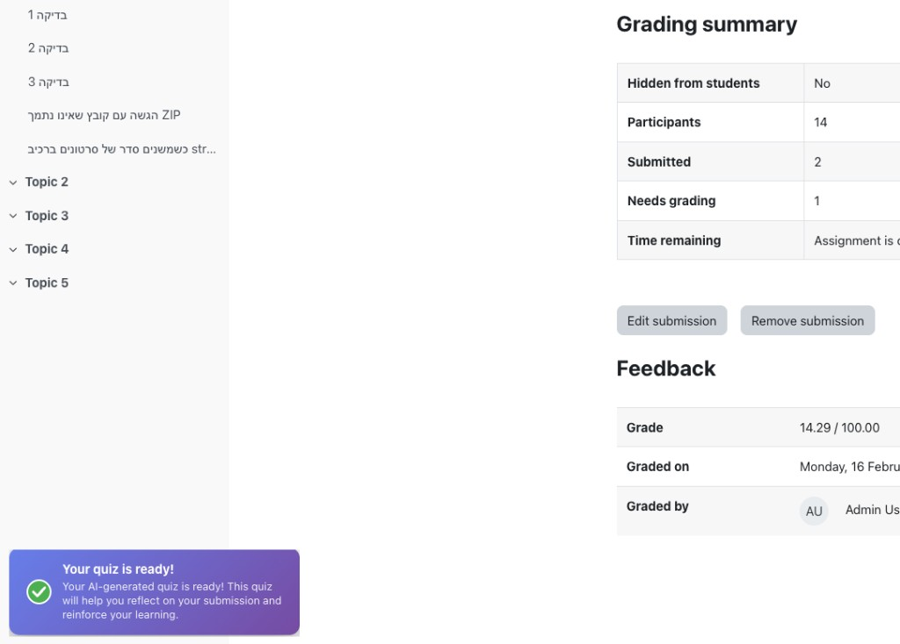

**"Your quiz is ready! Your AI-generated quiz is ready! This quiz will help you reflect on your submission and reinforce your learning."**

### המסך לפני כניסה לחידון (02)

המסך שמוצג לסטודנט לפני התחלת החידון: הודעת Formal Assessment, כללי החידון, הגבלה לניסיון אחד, זמן לכל שאלה, מניעת חזרה לשאלות קודמות.

### חידון הסטודנט (03)

מסך החידון עצמו: שאלות שנוצרו ע"י AI, מבוססות ההגשה, טיימר לשאלה, ניווט בין שאלות.

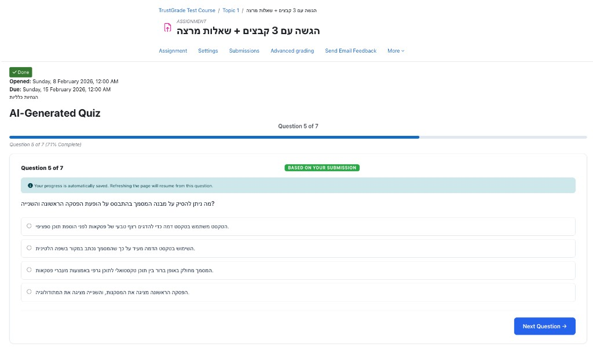

- **Question X of Y** – התקדמות. **Time Remaining** – זמן לכל שאלה.
- **BASED ON YOUR SUBMISSION** – השאלות מבוססות על ההגשה שלך.
- **אפשרויות בחירה** – לבחור תשובה אחת. **Next Question →** – מעבר לשאלה הבאה.

ההתקדמות נשמרת אוטומטית; רענון דף ממשיך מהשאלה הנוכחית.

### סיום החידון (05)

מסך הסיום לאחר שהסטודנט השלים את החידון: ציון סופי, סטטוס החידון, הצגת התשובות, סימון תשובות נכונות ושגויות.

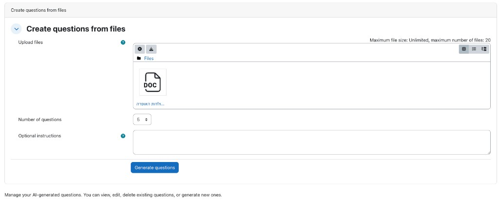

אם המרצה הפעיל **חייב את הסטודנט/ית להשלים את החידון**, גישה לעמודים אחרים ב-Moodle תיחסם עד השלמת החידון (עד 24 שעות מהפעם הראשונה).

---

## שאלות נפוצות

### למרצים

**איך מגיעים לדוח החידון?**  
מטלה → **עוד** → **TrustGrade Report** (או **דוח חידון**).

**איך בודקים הנחיות עם AI?**  
מטלה → **עוד** → **מאגר שאלות ובדיקת הנחיות** → **בדוק הנחיות עם AI**.

**איפה מופיעה הערכת ההגשה (AI)?**  
בדוח החידון – **הצג פרטים** אצל כל סטודנט; ובעמוד הציונים – קישור "דוח תלמיד (הערכת הגשה AI)" למי שיש לו ציון חידון.

**השאלות לא נוצרות.**  
וודא ש-TrustGrade מופעל למטלה, שהסטודנט הגיש והחיבור ל-Gateway פעיל (ניהול אתר → הגדרות TrustGrade).

### לסטודנטים

**איפה החידון שלי?**  
אחרי הגשה, כשהחידון מוכן תופיע הודעה "Your quiz is ready!" בעמוד המטלה – משם נכנסים לחידון.

**הדף נחסם ורוצה שאסיים חידון.**  
המרצה הפעיל "חייב את הסטודנט/ית להשלים את החידון". יש להשלים את חידון TrustGrade של המטלה; החסימה עד 24 שעות מהפעם הראשונה.

**ההתקדמות נשמרת?**  
כן. רענון דף או יציאה וחזרה ימשיכו מהשאלה שבה עצרת.

---

## צילומי מסך

צילומי המסך ממוקמים בתיקייה `docs/screenshots/` (01, 02, 03, 05–07, 09, 09b, 10, 12, 12b, 13–17, 19, 20, 22, 23). מיפוי מפורט והסבר לכל תמונה ב־`docs/screenshots/README.txt`.

---

**תמיכה:** לשאלות טכניות או למנוי לשירות TrustGrade AI Gateway – פנה ל-Originality LTD / CentricApp (support@centricapp.co / https://centricapp.co).
